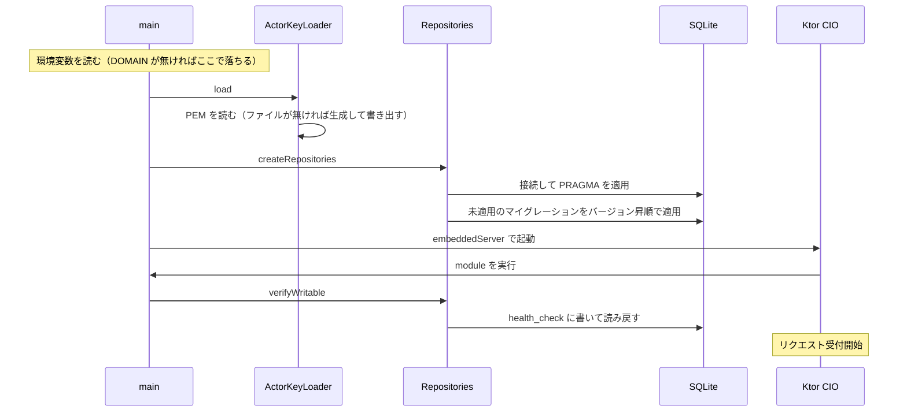

# 開発
`TODO.md`を確認する

作業が完了したら、対応する `TODO.md` のチェックボックスを都度更新する（`- [ ]` → `- [x]`）。
一部だけ実装した場合はチェックを付けず、実装状況が分かる補足を項目の下に追記する。

# ルール
日本語で記述するもの
- コードコメント
- PR文
- コミットコメント
- テスト名

## ドキュメント
Markdown で `**` による太字装飾を使わない。強調したい場合は文章の書き方で表現する。

---

# 実装メモ

README には使い方だけを置く。ここから下は中の作りと、そう決めた理由。

## モジュールの分け方

`:backend` から見えるのは `:backend:repository` の公開 API だけ。実装は `internal` で、
sqlite-jdbc も `implementation` で入れているため、JDBC の型は `:backend` の
compile classpath にも現れない。

`:backend:crypto` は `:backend` がアクターの鍵を読むために使っている。HTTP Signatures の
署名と検証で使うのは Phase 2 から。別モジュールに切り出してあるのは、
テストを native バイナリとして実行するため。`:backend` のテストは
`ktor-server-test-host` 経由で ByteBuddy と JNA を引き込み、これらは実行時の
バイトコード書き換えに依存するので native-image では動かない。JCA の確認を
そこに同居させると確認できなくなる。

`:frontend` と `:backend` のビルドを繋がないのは、繋ぐとサーバーのテストが
Kotlin/Wasm のツールチェイン（Node.js と yarn）に引きずられるため。wasm 側が
壊れているとサーバーのテストも回せなくなる。配信は実行時のディレクトリを読む形にして、
ビルドの依存を作らない。詳細は [TODO.md](TODO.md) の「ビルドと配布の分け方」を参照。

## ドメインとユーザー名

`DOMAIN` は `https://` などの scheme と末尾の `/` を書いても落として扱う。
未設定だと起動しない。既定値を用意して起動できてしまうと `localhost` のような
ドメインが焼き込まれたアクター ID を配ることになり、Mastodon はリモートアクターを
永続キャッシュするので、一度取得されると相手側からは直せないため。

`ACTOR_USERNAME` に使えるのは英数字と `_` `.` `-` で、先頭と末尾は英数字か `_`。
URL のパスと `acct:` の両方に入るので、区切り文字が混ざると別のものを指してしまう。
ドメインと同じく、変えると相手からは別人のアカウントに見える。

Mastodon は `@admin@example.com` の検索でまず WebFinger を引き、`links` の
`rel: "self"` から Actor の URL を得て、そこを取得してプロフィールカードを作る。
`Content-Type` は WebFinger が `application/jrd+json`、Actor が
`application/activity+json`（`Accept` に `application/ld+json` が来たらそちら）。
ここを間違えるとアクターとして認識されず、検索しても何も出ない。

## 起動時の流れ



DB を開けなかった場合もマイグレーションに失敗した場合も、この時点で例外になって
起動が止まる。native バイナリでは SQLite のネイティブライブラリの展開に失敗しても
起動自体は通ってしまうことがあるため、書き込みの往復まで確かめている。

鍵は DB より先に読む。鍵を用意できないならサーバーを立てても意味が無いので、
先に落とすため。`DOMAIN` が無い場合も同じ理由でそれより前に落ちる。

ログは slf4j-simple で標準エラーに出る。SLF4J の実装を入れていないと Ktor 自身の
ログも含めて何も出ないため、実装を 1 つだけ入れている。logback にしないのは、
設定ファイルの読み込みに native-image 側の追加対応が要るため。

## 動作確認用のアカウント

`test-` で始まる名前は、設定に関係なくすべてアクターとして応答する。
`@test-1@example.com` でも `@test-20260808@example.com` でも引ける。

```sh
curl "http://localhost:8080/.well-known/webfinger?resource=acct:test-1@example.com"
curl -H 'Accept: application/activity+json' http://localhost:8080/users/test-1
```

Mastodon はリモートアクターを永続キャッシュするので、内容や鍵を間違えたまま
一度取得されると相手側からは直せない。`admin` で試して失敗すると `admin` が
使えなくなるため、検証はこちらを使い、名前を変えながらやり直す。

- 中身は固定アクターと同じで、鍵も共有する。使い捨てのたびに鍵を作る意味が無いため
- `summary` が「動作確認用のアカウント」になるので、Mastodon 側の表示でも見分けられる
- 接頭辞は小文字ちょうど。`Test-1` は 404 になる（受けると `test-1` と別のアクターが生えるため）
- Phase 6 でアクターを DB から作れるようになったら消す

## アクターの鍵

Mastodon はアクターの公開鍵を持っておき、こちらから送る署名をそれで検証する。
鍵が入れ替わると検証が通らなくなり、Mastodon 側はアクターをキャッシュするので
気付いてから直しても戻りが遅い。つまり鍵は消さずに持ち続ける必要がある。

保存するのは秘密鍵だけで、公開鍵は起動のたびに秘密鍵から導く。2 つ持って
片方だけ差し替わる事故を避けるため。形式は PKCS#8 の `BEGIN PRIVATE KEY`。

読み込み元は 2 つあり、同時には指定できない。取り違えたまま起動しないよう、
両方が設定されていると起動時に落とす。

| 指定 | 動き |
| --- | --- |
| `ACTOR_PRIVATE_KEY_PATH`（既定） | ファイルがあれば読む。無ければ生成して書き出す（所有者のみ読み書き可） |
| `ACTOR_PRIVATE_KEY_PEM` | PEM をそのまま使う。ファイルには書き出さない |

どちらから読んだかは起動ログに出る。生成した場合だけ警告になるので、
運用中に出ていたら以前の鍵を失っていることになる。

docker compose ではボリュームの中（`/data/actor-private-key.pem`）に置いている。
コンテナを作り直しても同じ鍵のままだが、ボリュームごと消すとアクターは別人になる。

## JSON の返し方

Ktor の `ContentNegotiation` は入れていない。`call.respond(value)` は値の型から
serializer をリフレクションで引くため、native-image では解決できず実行時に 500 になる。
JVM のテストは通るので native バイナリを起動するまで気付けない、という形の不具合になる。

代わりに serializer を明示する。

```kotlin
call.respondJson(HealthResponse.serializer(), HealthResponse(status = "ok"))
```

ActivityPub のエンドポイントでは Content-Type も明示する。`Accept` に応じて
`application/activity+json` と `application/ld+json` を選ぶのは
`ActivityPubContentTypes.negotiate()`。

受信も同様に `call.receive<T>()` を使わず、`receiveText()` してから
`AppJson.decodeFromString(Foo.serializer(), body)` で読む。inbox は HTTP Signature の
Digest 検証に生のボディが必要なので、どのみち自動デコードには乗せられない。

## マイグレーション

スキーマ変更は `backend/repository/src/main/resources/db/migration/` に
`V002__説明.sql` のような連番のファイルを足す。起動時に未適用のものが
バージョン昇順で適用され、適用済みのバージョンは `schema_version` テーブルに記録される。

ファイル名の一覧 (`db/migration/index`) は Gradle が生成するので、手で書く必要はない。
これは jar 内のディレクトリ走査が native-image で動かないことがあるため。

適用済みのファイルは書き換えないこと。チェックサムを記録しているので、
変更すると次の起動時にエラーになる。修正は新しい連番のファイルで行う。

現在のテーブル:

| テーブル | 内容 |
| --- | --- |
| `schema_version` | 適用済みマイグレーションの記録。バージョン・名前・チェックサム・適用日時 |
| `health_check` | 起動時の書き込み確認用。行は常に 1 件 |
