# mastodon-rss
RSS/Atom フィードを ActivityPub アクターとして配信し、Mastodon からフォローできるようにする自作サーバー。

開発の進め方とロードマップは [TODO.md](TODO.md)、横断的な設計は
[docs/architecture.md](docs/architecture.md)、Mastodon から見える仕様
（エンドポイント・鍵の扱いなど）は [docs/mastodon-spec.md](docs/mastodon-spec.md) を参照。

## モジュール構成

| モジュール | ディレクトリ | 内容 |
| --- | --- | --- |
| `:backend` | `backend/` | Ktor (CIO) のサーバー。GraalVM native-image でビルドする |
| `:backend:graphql` | `backend/graphql/` | 管理 API のスキーマと、そこから生成したモデル・リゾルバのインタフェース |
| `:frontend` | `frontend/` | Compose Multiplatform for Web (Kotlin/Wasm) の画面。管理画面とアカウント画面 |
| `:shared` | `shared/` | `:backend` と `:frontend` の両方から見る値。今は GraphQL のパスだけ |

`:backend` の下には `:backend:feature-mastodon`（ActivityPub の実装）、
`:backend:crypto`（鍵と署名）、`:backend:repository`（データの取得と保存）、
`:backend:rss`（RSS/Atom の解析）がある。

`:backend:feature-mastodon` はこのアプリ固有のものを持たない。`ServerEnv` も
`Repositories` も参照せず、必要な設定は引数で受け取る。後から単体のライブラリとして
切り出せるようにするため。

```mermaid
flowchart TB
    subgraph backend[":backend"]
        main["main"]
        env["ServerEnv<br/>環境変数を読むのはここだけ"]
        module["Application.module"]
        route["routing<br/>GET /healthz"]
        deps["AppDependencies<br/>作る順と閉じる順"]
        graphql["graphql<br/>POST /graphql<br/>GraphQlEngine"]
        resolver["graphql.resolver<br/>QueryResolverImpl / MutationResolverImpl<br/>AdminQueryResolverImpl / AdminMutationResolverImpl"]
        admin["admin<br/>AdminSessions<br/>セッション Cookie"]
        static["staticfiles<br/>StaticFiles<br/>staticRoutes"]
    end

    subgraph mastodon[":backend:feature-mastodon"]
        json["json<br/>AppJson<br/>respondJson"]
        ap["activitypub<br/>ActivityPubContentTypes<br/>StringListSerializer<br/>LinkOrObject"]
        actor["actor<br/>ActorKeyLoader<br/>ActorKey<br/>ActorUrls<br/>HttpRemoteActors"]
        webfinger["webfinger<br/>GET /.well-known/webfinger"]
        actorroute["actor のルート<br/>GET /users/{name}"]
        inbox["inbox<br/>POST /users/{name}/inbox<br/>InboxService.default<br/>FollowHandler"]
        nodeinfo["nodeinfo<br/>GET /.well-known/nodeinfo<br/>GET /nodeinfo/2.1"]
        sig["httpsignature<br/>HttpSignatureVerifier<br/>HttpSignatureSigner<br/>SigningString<br/>BodyDigest"]
        delivery["delivery<br/>HttpActivityDelivery"]
    end

    subgraph crypto[":backend:crypto"]
        keys["RsaKeys<br/>鍵ペア生成 / PEM 入出力"]
        sign["RsaSignature<br/>SHA256withRSA"]
        pass["PasswordHash<br/>PBKDF2-HMAC-SHA256"]
    end

    subgraph repository[":backend:repository"]
        api["公開 API<br/>Repositories<br/>DatabaseConfig"]
        impl["internal 実装<br/>SqliteRepositories<br/>SqliteConnectionManager"]
        gen["jOOQ 生成コード<br/>ビルド時に schema.sql から生成<br/>git には入らない"]
        res["リソース<br/>db/schema.sql"]
    end

    subgraph rss[":backend:rss"]
        parser["FeedParser<br/>RSS 2.0 / RSS 1.0 / Atom 1.0"]
        feedmodel["ParsedFeed<br/>ParsedFeedItem<br/>FeedContent"]
        feedutil["FeedItemKey 差分検出の鍵<br/>HtmlSanitizer 配信前に削る<br/>FeedDates / FeedText"]
        youtube["YouTubeFeedResolver<br/>貼られた URL をフィードの URL に直す"]
    end

    subgraph frontend[":frontend"]
        compose["Compose Multiplatform for Web<br/>Kotlin/Wasm<br/>Navigation 3 で画面を出し分け"]
        apollo["Apollo Kotlin<br/>スキーマから生成したクライアント"]
    end

    subgraph graphqlschema[":backend:graphql"]
        schemafile["schema.graphqls<br/>admin_query.graphqls<br/>admin_mutation.graphqls<br/>directive.graphqls"]
        qlmodel["graphql.model<br/>QlAdminSession / QlAdminLoginResult<br/>QueryResolver / AdminMutationResolver<br/>ビルド時に生成。git には入らない"]
    end

    db[("SQLite<br/>DB_PATH")]

    main --> env
    main --> deps
    main --> module
    module --> route
    route --> json
    json --> ap
    deps -->|createRepositories| api
    deps -->|ActorKeyLoader.load| actor
    deps -->|InboxService.default| inbox
    module -->|verifyWritable| api
    api -.->|backend からは見えない| impl
    impl -->|テーブルの型| gen
    res -.->|codegen の入力| gen
    impl --> db
    actor --> keys
    module --> webfinger
    module --> actorroute
    module --> inbox
    module --> nodeinfo
    webfinger --> actor
    actorroute --> actor
    module --> graphql
    graphql -->|リゾルバの実装を渡して結線| resolver
    resolver -->|セッションの発行と検証| admin
    resolver -->|パスワードの照合| pass
    inbox --> sig
    inbox -->|Follow に Accept| delivery
    delivery -->|送信の署名| sig
    sig -->|署名の検証と生成| sign
    sig -->|keyId から公開鍵| actor
    inbox -->|相手の inbox| actor
    remote[("相手のサーバー<br/>アクター文書を GET<br/>inbox に POST")]
    actor --> remote
    delivery --> remote
    key[("秘密鍵の PEM<br/>ACTOR_PRIVATE_KEY_PATH")]
    actor --> key
    dist[("静的ファイル<br/>STATIC_SRC_DIR")]
    module --> static
    static --> dist
    compose -.->|デプロイ時に配置| dist
    compose --> apollo
    apollo -->|POST /graphql| graphql
    schemafile -->|実行時に読む| graphql
    schemafile -.->|ビルド時にコード生成| qlmodel
    schemafile -.->|ビルド時にコード生成| apollo
    qlmodel -->|実装するインタフェース| resolver
    parser --> feedmodel
    parser --> feedutil
    main -.->|Phase 5 で繋ぐ。いまは :backend から参照していない| parser
```



`:frontend` と `:backend` は別々にビルドする。互いに依存させない。
`:backend:graphql` の管理 API のスキーマは `:frontend` がコード生成の入力として
ファイルで読むだけで、モジュールとしては依存しない。両方が要る値だけを `:shared` に置く。
`:frontend` の成果物は配信するファイルを置くディレクトリに配置し、`:backend` が
その場所を `STATIC_SRC_DIR` で受け取って root から配信する。
分けた理由は [docs/architecture.md](docs/architecture.md) を参照。

## 必要なもの

JDK が 1 つあれば足りる。バージョンは問わない（Gradle を起動できればよい）。

ビルドに使う JDK 25 と、native-image に使う GraalVM 25 は Gradle が必要に応じて
取ってくる（`settings.gradle.kts` の foojay-resolver）。手元に入れてあるものが
条件に合えばそれを使い、無ければダウンロードして `~/.gradle/jdks` に置く。

Gradle 自体も wrapper が入っているので個別のインストールは不要。

### Codex Cloud

Codex Cloud のセットアップスクリプトには `.codex/setup.sh` を指定する。
このスクリプトは foojay-resolver に JDK 25 と GraalVM 25 の用意を任せ、CI で行う
コード整形の確認、JVM テスト、frontend の配布ビルド、native テスト、native-image の
ビルドをまとめて実行する。初回はツールチェインも取得するため時間がかかる。

リポジトリの環境変数には、次節にある `GITHUB_ACTOR` と `GITHUB_TOKEN` を設定する。
セットアップ後に同じ一式を確認したい場合も、リポジトリルートで次を実行する。

```sh
./.codex/setup.sh
```

### GitHub Packages の資格情報

管理 API のコード生成に使う graphql-java-codegen は
[matsudamper/graphql-java-codegen](https://github.com/matsudamper/graphql-java-codegen)
の fork のビルドを GitHub Packages から取る。無いと構成の時点で落ちるので、
`~/.gradle/gradle.properties` に置く。

```properties
gpr.user=<GitHub のユーザー名>
gpr.key=<read:packages を付けたパーソナルアクセストークン>
```

環境変数 `GITHUB_ACTOR` / `GITHUB_TOKEN` でも読む。CI はそちらを使っている。

## ビルド

### 全体

```sh
# ビルドとテスト
./gradlew build

# テストのみ
./gradlew test
```

### backend

```sh
# JVM で起動する（http://localhost:8080）
# DOMAIN は必須。手元で試すだけなら適当な値でよいが、
# Mastodon から実際に引かせるときは公開しているホスト名にすること
DOMAIN=example.com ./gradlew :backend:run
```

起動できたかは `GET /healthz` で見る。`{"status":"ok"}` が返れば動いている。

### backend の native-image

GraalVM は Gradle が用意するので、事前のインストールは要らない。初回は
ダウンロードするぶん時間がかかる。

```sh
# ネイティブバイナリを生成する
./gradlew :backend:nativeCompile

# 生成されたバイナリを起動する
DOMAIN=example.com ./backend/build/native/nativeCompile/mastodon-rss
```

### frontend

```sh
# 開発サーバーを起動する（http://localhost:8081、ホットリロードあり）
./gradlew :frontend:wasmJsBrowserDevelopmentRun

# 配布物を生成する
./gradlew :frontend:wasmJsBrowserDistribution
```

配布物は `frontend/build/dist/wasmJs/productionExecutable/` に出力される。

初回ビルドでは Kotlin/Wasm のツールチェイン（Node.js、yarn、webpack など）が
ダウンロードされるため時間がかかる。

### backend から画面を出す

```sh
./gradlew :frontend:wasmJsBrowserDistribution

# DOMAIN は画面の配信には関係しないが、必須なので入れる
DOMAIN=example.com \
STATIC_SRC_DIR=frontend/build/dist/wasmJs/productionExecutable \
  ./gradlew :backend:run
```

配信の挙動は
[StaticFiles.kt](backend/src/main/kotlin/net/matsudamper/mastodon/rss/staticfiles/StaticFiles.kt)、
環境変数は [ServerEnv.kt](backend/src/main/kotlin/net/matsudamper/mastodon/rss/ServerEnv.kt) を参照。

### 画面のパス

サーバーが持つパス以外は静的ファイルの配信に落ちる。ファイルがあればそれを返し、
無ければ `index.html` を返して画面側に解釈させる。どの画面を出すかはブラウザ側の判断になる。

| パス | 画面 |
| --- | --- |
| `/` | トップ |
| `/@{name}` | アカウント画面。フィードの取得状況と配信した記事 |
| `/admin` | 管理画面のトップ。ログインと、下の各画面への入口 |
| `/admin/accounts` | アカウントの一覧 |
| `/admin/accounts/new` | アカウントの追加 |
| それ以外 | 見つからない（HTTP は 200 のまま） |

管理画面の操作は 1 画面に並べず、操作ごとにパスを分ける。
開いた時点で必要のない問い合わせが走らず、URL でその操作を指せる。
`/admin` の下の知らないパスは、管理画面ではなく見つからない扱いにする。

### 管理画面のログイン

`/admin` にはログインが要る。パスワード 1 つで、ユーザー名は無い。

パスワードそのものはサーバーに置かず、ハッシュを `ADMIN_PASSWORD_HASH` に入れる。
ハッシュは標準入力にパスワードを渡して作る。引数にするとシェルの履歴と `ps` に平文で残る。

```sh
# 表示された 1 行がそのまま ADMIN_PASSWORD_HASH の値
./gradlew --quiet :backend:crypto:passwordHash
```

手元で試すときは `ADMIN_COOKIE_SECURE=false` を付ける。既定ではセッション Cookie に
`Secure` が付き、`http://localhost:8080` ではブラウザが Cookie を保存しないので、
ログインしてもログインしていない状態のままになる。

```sh
DOMAIN=example.com \
STATIC_SRC_DIR=frontend/build/dist/wasmJs/productionExecutable \
ADMIN_PASSWORD_HASH='pbkdf2-sha256:...' \
ADMIN_COOKIE_SECURE=false \
  ./gradlew :backend:run
```

`ADMIN_PASSWORD_HASH` が未設定でも起動する。最初のハッシュを作る前に起動できないと
先に進めないため。この場合はログインできず、画面と起動ログにその旨が出る。

ログインすると `/admin` に各画面への入口が出る。いまあるのはアカウントの一覧と追加で、
フィードの登録や配信状況はこれから作る。ログインしていない状態で下の画面を直接開いた場合は、
そこにフォームを出さず `/admin` に案内する。パスワードを入れる場所を 1 つに寄せるため。
セッションの持ち方と Cookie の扱いは [docs/architecture.md](docs/architecture.md) を参照。

### アカウントの追加

追加は `/admin/accounts/new`、一覧は `/admin/accounts`。
Mastodon から検索できる名前は 2 通りある。`ACTOR_USERNAME` で決まるものと、
管理画面から追加したもの。追加したものは `accounts` テーブルに入る。

名前は後から変えられない。Mastodon はリモートのアカウントを永続キャッシュするので、
アクターの ID が変わると相手には別のアカウントとして見える。別の名前にしたい場合は
作り直すことになる。

使える文字は `ACTOR_USERNAME` と同じで、長さは 30 文字まで。
`ACTOR_USERNAME` と同じ名前と、既にある名前は追加できない。

### API
graphqlを使用している `POST /graphql`
スキーマファースト`backend/graphql`モジュール参照

結線は graphql-java-tools (kickstart) が行う。リフレクションを使うので、native-image
向けにクラスを登録する。登録はイメージのビルド時に `GraphQlReflectionFeature` が
クラスパスを走査して行うので、スキーマを触っても設定ファイルの更新は要らない。
ただしリゾルバの実装は `graphql.resolver` パッケージに置くこと（走査の対象から
外れていないかは `GraphQlReflectionTargetsTest` が見ている）。

native バイナリで動くことは確認済み（`/graphql` に query・mutation・変数・enum・
`Set-Cookie` まで通した）。そのために足した指定と、それぞれ何で落ちたかは
[native-image の README](backend/src/main/resources/META-INF/native-image/net.matsudamper/mastodon-rss-backend/README.md)
に書いてある。

画面は canvas に描いているので、ブラウザの持っているフォントは使われない。日本語を出すために
Noto Sans JP を `/fonts/*.ttf` として一緒に配信し、起動後に読み込んで当てている。
実体は `frontend/src/wasmJsMain/resources/fonts/`（SIL Open Font License 1.1。同じ場所に
`OFL.txt` を置いてある）で、読み込みは `:frontend` の `ui/Font.kt`。

表示している数値と記事はまだ仮の値で、画面の上にその旨を出している。

## 環境変数

| 変数 | 既定値 | 内容 |
| --- | --- | --- |
| `HOST` | `0.0.0.0` | バインドするアドレス |
| `PORT` | `8080` | 待ち受けポート |
| `DB_PATH` | `./data/mastodon-rss.db` | SQLite の DB ファイル。親ディレクトリは起動時に作られる |
| `DOMAIN` | **必須** | 外部に公開するドメイン。WebFinger の `acct:` とアクターの `id` に使う |
| `ACTOR_USERNAME` | `admin` | 設定で決まるアカウントの名前。`acct:<name>@<DOMAIN>` と `/users/<name>` に入る |
| `ACTOR_PRIVATE_KEY_PATH` | `./data/actor-private-key.pem` | アクターの秘密鍵 (PEM)。無ければ起動時に生成して書き出す |
| `ACTOR_PRIVATE_KEY_PEM` | なし | 秘密鍵の PEM を直接渡す場合に使う。`ACTOR_PRIVATE_KEY_PATH` とは併用できない |
| `STATIC_SRC_DIR` | なし | 配信する静的ファイルのディレクトリ。未設定なら何も配信しない |
| `ADMIN_PASSWORD_HASH` | なし | 管理画面のパスワードハッシュ。未設定でも起動するが、その間はログインできない |
| `ADMIN_COOKIE_SECURE` | `true` | セッション Cookie に `Secure` を付けるか。手元で http で試すときだけ `false` にする |

`DOMAIN` は scheme と末尾の `/` を書いても落として扱う。未設定だと起動しない。
`ACTOR_USERNAME` に使えるのは英数字と `_` `.` `-` で、先頭と末尾は英数字か `_`、
長さは 30 文字まで。

どちらもアクターの ID に焼き込まれ、変えると相手からは別人のアカウントに見える。
理由は `ServerEnv.kt` と `ActorUsernameUtil.kt` の KDoc にある。

`ACTOR_USERNAME` のアカウントは設定でしか変えられない。それ以外は管理画面から追加する。

エンドポイント、アカウントの引き当て、アクターの鍵の扱いなど、
ビルド以外の仕様は [docs/mastodon-spec.md](docs/mastodon-spec.md) にまとめてある。

## スキーマを変えるとき

`schema.sql` と同じ場所に置いた
[backend/repository/src/main/resources/db/README.md](backend/repository/src/main/resources/db/README.md)
を参照。開発用 DB から `dumpSchema` で書き出して commit し、実 DB へは sqlite3def で
手適用する。そこから jOOQ の型が作られるまでも書いてある。
