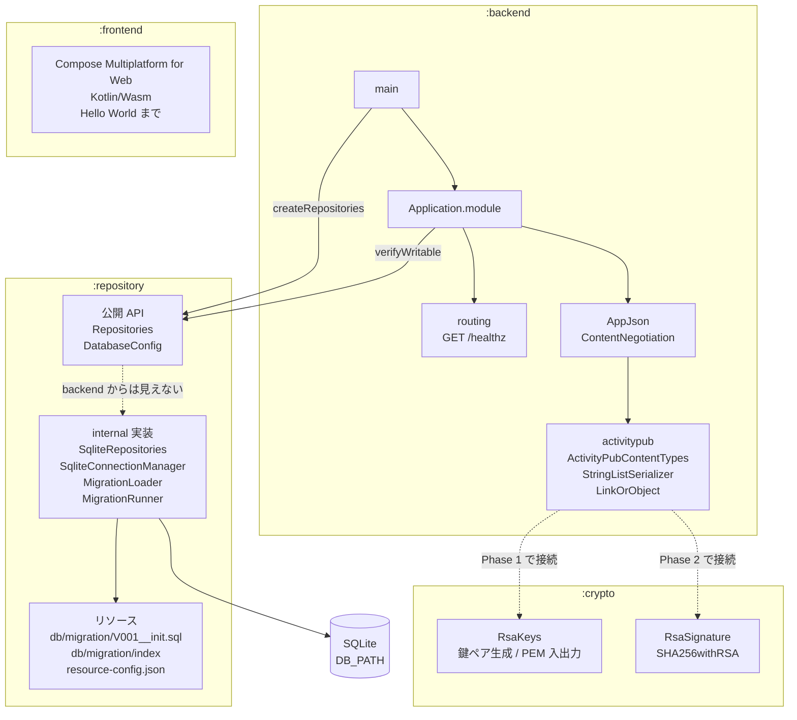
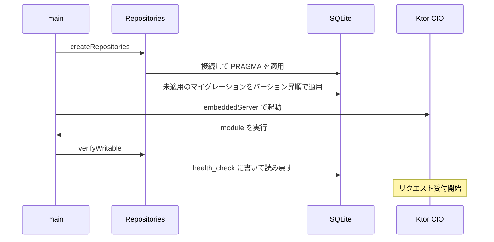

# mastodon-rss
RSS/Atom フィードを ActivityPub アクターとして配信し、Mastodon からフォローできるようにする自作サーバー。

開発の進め方とロードマップは [TODO.md](TODO.md) を参照。

## モジュール構成

| モジュール | 内容 |
| --- | --- |
| `:backend` | Ktor (CIO) のサーバー。GraalVM native-image でビルドする |
| `:crypto` | RSA 鍵と署名。JCA だけに依存し、Ktor も JDBC も入らない |
| `:repository` | SQLite への DB アクセス。公開するのは interface だけで、JDBC や SQL は外に出さない |
| `:frontend` | Compose Multiplatform for Web (Kotlin/Wasm) の管理画面 |



`:backend` から見えるのは `:repository` の公開 API だけ。実装は `internal` で、
sqlite-jdbc も `implementation` で入れているため、JDBC の型は `:backend` の
compile classpath にも現れない。

`:crypto` はまだどこからも参照されていない。Actor の公開鍵を配る Phase 1 と、
HTTP Signatures を実装する Phase 2 で `:backend` から使う。先に切り出してあるのは、
テストを native バイナリとして実行するため。`:backend` のテストは
`ktor-server-test-host` 経由で ByteBuddy と JNA を引き込み、これらは実行時の
バイトコード書き換えに依存するので native-image では動かない。JCA の確認を
そこに同居させると確認できなくなる。

`:frontend` はまだ独立している。`:backend` が静的配信として取り込むのは Phase 8 で、
いまは 8081 番の dev サーバーで単独起動するだけ。

## 起動時の流れ



DB を開けなかった場合もマイグレーションに失敗した場合も、この時点で例外になって
起動が止まる。native バイナリでは SQLite のネイティブライブラリの展開に失敗しても
起動自体は通ってしまうことがあるため、書き込みの往復まで確かめている。

## 環境変数

| 変数 | 既定値 | 内容 |
| --- | --- | --- |
| `HOST` | `0.0.0.0` | バインドするアドレス |
| `PORT` | `8080` | 待ち受けポート |
| `DB_PATH` | `./data/mastodon-rss.db` | SQLite の DB ファイル。親ディレクトリは起動時に作られる |
| `DOMAIN` | なし | 外部に公開するドメイン。WebFinger の `acct:` とアクターの `id` に使う |

`DOMAIN` は `https://` などの scheme と末尾の `/` を書いても落として扱う。
いまは起動ログに出るだけで、実際に使うのは Phase 1 から。アクター ID に焼き込まれ、
Mastodon 側にキャッシュされると後から変えられないので、本番では慎重に決めること。

## 必要なもの

- JDK 21
- native-image をビルドする場合は GraalVM 21

Gradle は wrapper が入っているので個別のインストールは不要。

## ビルド

### 全体

```sh
./gradlew build
```

### backend

```sh
# ビルドとテスト
./gradlew :backend:build

# テストのみ
./gradlew :backend:test

# repository のビルドとテスト
./gradlew :repository:build

# JVM で起動する（http://localhost:8080）
./gradlew :backend:run
```

### crypto

```sh
# ビルドとテスト
./gradlew :crypto:build

# テストを native バイナリにして実行する（GraalVM 21 が必要）
./gradlew :crypto:nativeTest
```

`nativeTest` は JCA（RSA 鍵生成・SHA256withRSA 署名）が native-image 上で動くことを
確かめるために入れている。この種の問題は JVM のテストでは分からず、native バイナリを
動かして初めて出るため、テストごと native にして CI で継続的に見る。

### backend の native-image

GraalVM 21 が必要。

```sh
# ネイティブバイナリを生成する
./gradlew :backend:nativeCompile

# 生成されたバイナリを起動する
./backend/build/native/nativeCompile/mastodon-rss
```

### frontend

```sh
# 開発サーバーを起動する（http://localhost:8081、ホットリロードあり）
./gradlew :frontend:wasmJsBrowserDevelopmentRun

# 配布物を生成する
./gradlew :frontend:wasmJsBrowserDistribution
```

配布物は `frontend/build/dist/wasmJs/productionExecutable/` に出力される。

初回ビルドでは Kotlin/Wasm のツールチェイン（Node.js、yarn、webpack など）が
ダウンロードされるため時間がかかる。

## Docker で動かす

```sh
cp .env.example .env
# .env の DOMAIN を書き換えてから
docker compose up -d
```

`DOMAIN` は必須で、未設定だと compose が起動前に失敗する。

イメージは multi-stage build で、GraalVM のステージで native バイナリを作り、
実行用のステージには JDK を持ち込まない。初回は Gradle の依存取得と native-image の
ビルドが走るため時間がかかる。

DB は `data` という名前付きボリュームに置く。コンテナを作り直してもフォロワーは残る。

`HEALTHCHECK` で `/healthz` を叩いている。起動時にマイグレーションと書き込み確認が
走るので、healthy になった時点で DB まで通っている。

### GitHub Packages のイメージを使う

`main` にマージすると ghcr.io にイメージが publish される。タグは `latest` と commit SHA。

```sh
docker pull ghcr.io/matsudamper/mastodon-rss:latest
```

自分でビルドせずこれを使う場合は `docker-compose.yml` の `build:` を消す。

なお 8080 を直接インターネットに晒さないこと。ActivityPub は HTTPS 前提なので、
前段にリバースプロキシを置く。

## マイグレーション

スキーマ変更は `repository/src/main/resources/db/migration/` に
`V002__説明.sql` のような連番のファイルを足す。起動時に未適用のものが
バージョン昇順で適用され、適用済みのバージョンは `schema_version` テーブルに記録される。

ファイル名の一覧 (`db/migration/index`) は Gradle が生成するので、手で書く必要はない。
これは jar 内のディレクトリ走査が native-image で動かないことがあるため。

適用済みのファイルは書き換えないこと。チェックサムを記録しているので、
変更すると次の起動時にエラーになる。修正は新しい連番のファイルで行う。

現在のテーブル:

| テーブル | 内容 |
| --- | --- |
| `schema_version` | 適用済みマイグレーションの記録。バージョン・名前・チェックサム・適用日時 |
| `health_check` | 起動時の書き込み確認用。行は常に 1 件 |
