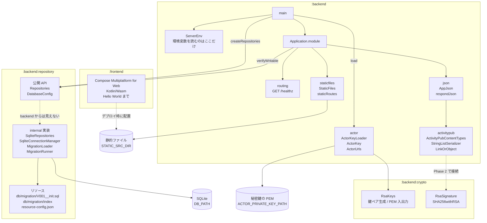

# mastodon-rss
RSS/Atom フィードを ActivityPub アクターとして配信し、Mastodon からフォローできるようにする自作サーバー。

開発の進め方とロードマップは [TODO.md](TODO.md)、横断的な設計は
[docs/architecture.md](docs/architecture.md) を参照。

## モジュール構成

| モジュール | ディレクトリ | 内容 |
| --- | --- | --- |
| `:backend` | `backend/` | Ktor (CIO) のサーバー。GraalVM native-image でビルドする |
| `:frontend` | `frontend/` | Compose Multiplatform for Web (Kotlin/Wasm) の管理画面 |



`:frontend` と `:backend` は別々にビルドする。互いに依存させない。
`:frontend` の成果物は配信するファイルを置くディレクトリに配置し、`:backend` が
その場所を `STATIC_SRC_DIR` で受け取って root から配信する。
分けた理由は [docs/architecture.md](docs/architecture.md) を参照。

## 必要なもの

- JDK 25
- native-image をビルドする場合は GraalVM 25

Gradle は wrapper が入っているので個別のインストールは不要。

## ビルド

### 全体

```sh
# ビルドとテスト
./gradlew build

# テストのみ
./gradlew test
```

`test` のようにプロジェクトのパスを付けない指定は、全プロジェクトの同名タスクに
展開される。対象は `:backend`、`:backend:crypto`、`:backend:repository` の 3 つで、
`:frontend` は wasmJs ターゲットだけなので `test` を持たず対象にならない。
CI の backend ジョブもこれを使っている。

逆に `:backend:test` のようにパスで絞ると、そのモジュールのテストしか走らない。
依存先のモジュールは jar が作られるだけでテストは走らないので、モジュールを
またいで確かめたいときはパスを付けない方を使う。

### backend

```sh
# ビルドとテスト
./gradlew :backend:build

# テストのみ
./gradlew :backend:test

# JVM で起動する（http://localhost:8080）
# DOMAIN は必須。手元で試すだけなら適当な値でよいが、
# Mastodon から実際に引かせるときは公開しているホスト名にすること
DOMAIN=example.com ./gradlew :backend:run
```

### crypto の native テスト

```sh
# テストを native バイナリにして実行する（GraalVM 25 が必要）
./gradlew :backend:crypto:nativeTest
```

`nativeTest` は `check` にぶら下がっていないので、`./gradlew build` でも
`./gradlew test` でも走らない。名前を挙げて実行する必要がある。

### backend の native-image

GraalVM 25 が必要。

```sh
# ネイティブバイナリを生成する
./gradlew :backend:nativeCompile

# 生成されたバイナリを起動する
DOMAIN=example.com ./backend/build/native/nativeCompile/mastodon-rss
```

### frontend

```sh
# 開発サーバーを起動する（http://localhost:8081、ホットリロードあり）
./gradlew :frontend:wasmJsBrowserDevelopmentRun

# 配布物を生成する
./gradlew :frontend:wasmJsBrowserDistribution
```

配布物は `frontend/build/dist/wasmJs/productionExecutable/` に出力される。

初回ビルドでは Kotlin/Wasm のツールチェイン（Node.js、yarn、webpack など）が
ダウンロードされるため時間がかかる。

### backend から画面を出す

```sh
./gradlew :frontend:wasmJsBrowserDistribution

# DOMAIN は画面の配信には関係しないが、必須なので入れる
DOMAIN=example.com \
STATIC_SRC_DIR=frontend/build/dist/wasmJs/productionExecutable \
  ./gradlew :backend:run
```

配信の挙動は
[StaticFiles.kt](backend/src/main/kotlin/net/matsudamper/mastodon/rss/staticfiles/StaticFiles.kt)、
環境変数は [ServerEnv.kt](backend/src/main/kotlin/net/matsudamper/mastodon/rss/ServerEnv.kt) を参照。

## 環境変数

| 変数 | 既定値 | 内容 |
| --- | --- | --- |
| `HOST` | `0.0.0.0` | バインドするアドレス |
| `PORT` | `8080` | 待ち受けポート |
| `DB_PATH` | `./data/mastodon-rss.db` | SQLite の DB ファイル。親ディレクトリは起動時に作られる |
| `DOMAIN` | **必須** | 外部に公開するドメイン。WebFinger の `acct:` とアクターの `id` に使う |
| `ACTOR_USERNAME` | `admin` | アクターのユーザー名。`acct:<name>@<DOMAIN>` と `/users/<name>` に入る |
| `ACTOR_PRIVATE_KEY_PATH` | `./data/actor-private-key.pem` | アクターの秘密鍵 (PEM)。無ければ起動時に生成して書き出す |
| `ACTOR_PRIVATE_KEY_PEM` | なし | 秘密鍵の PEM を直接渡す場合に使う。`ACTOR_PRIVATE_KEY_PATH` とは併用できない |

`DOMAIN` は scheme と末尾の `/` を書いても落として扱う。未設定だと起動しない。
`ACTOR_USERNAME` に使えるのは英数字と `_` `.` `-` で、先頭と末尾は英数字か `_`。

どちらもアクターの ID に焼き込まれ、変えると相手からは別人のアカウントに見える。
理由は `ServerEnv.kt` と `ActorUsername.kt` の KDoc にある。

## エンドポイント

| パス | 内容 |
| --- | --- |
| `GET /healthz` | 生存確認。`{"status":"ok"}` |
| `GET /.well-known/webfinger?resource=acct:<name>@<domain>` | アカウント発見の 1 ホップ目 (RFC 7033) |
| `GET /users/{name}` | Actor JSON。プロフィールと公開鍵 |

`{name}` として応答するのは `ACTOR_USERNAME`（既定 `admin`）と、`test-` で始まる
任意の名前の 2 通り。後者は動作確認用で、下の「動作確認用のアカウント」を参照。

```sh
curl "http://localhost:8080/.well-known/webfinger?resource=acct:admin@example.com"
curl -H 'Accept: application/activity+json' http://localhost:8080/users/admin
```

外から見えるようにするには HTTPS が要る。開発中は Cloudflare Tunnel や ngrok で
`DOMAIN` に指定したホスト名に向ける。

## 動作確認用のアカウント

`test-` で始まる名前は、設定に関係なくすべてアクターとして応答する。
`@test-1@example.com` でも `@test-20260808@example.com` でも引ける。

```sh
curl "http://localhost:8080/.well-known/webfinger?resource=acct:test-1@example.com"
curl -H 'Accept: application/activity+json' http://localhost:8080/users/test-1
```

`admin` で試して失敗すると `admin` が使えなくなるので、検証はこちらを使い、
名前を変えながらやり直す。理由は `ActorUsername.kt` の KDoc にある。

- 中身は固定アクターと同じで、鍵も共有する
- `summary` が「動作確認用のアカウント」になるので、Mastodon 側の表示でも見分けられる
- 接頭辞は小文字ちょうど。`Test-1` は 404 になる

## アクターの鍵

鍵は消さずに持ち続ける必要がある。読み込み元は 2 つあり、同時には指定できない。
両方が設定されていると起動時に落とす。

| 指定 | 動き |
| --- | --- |
| `ACTOR_PRIVATE_KEY_PATH`（既定） | ファイルがあれば読む。無ければ生成して書き出す（所有者のみ読み書き可） |
| `ACTOR_PRIVATE_KEY_PEM` | PEM をそのまま使う。ファイルには書き出さない |

どちらから読んだかは起動ログに出る。生成した場合だけ警告になるので、
運用中に出ていたら以前の鍵を失っていることになる。

docker compose ではボリュームの中（`/data/actor-private-key.pem`）に置いている。
コンテナを作り直しても同じ鍵のままだが、ボリュームごと消すとアクターは別人になる。

保存するのは秘密鍵だけで、公開鍵は起動のたびに秘密鍵から導く。
鍵を持ち続ける理由とこの判断の理由は `ServerEnv.kt` の KDoc にある。

## Docker で動かす

```sh
cp .env.example .env
# .env の DOMAIN を書き換えてから
docker compose up -d
```

`DOMAIN` は必須で、未設定だと compose が起動前に失敗する。

初回は Gradle の依存取得と native-image のビルドが走るため時間がかかる。

DB は `data` という名前付きボリュームに置く。コンテナを作り直してもフォロワーは残る。

サーバーは `app`（uid 10001）として動く。`/data` の所有者は起動時に entrypoint が
合わせるので、名前付きボリュームなら何もしなくてよい。バインドマウントに変える場合は
ホスト側のディレクトリを uid 10001 にしておく。

`HEALTHCHECK` で `/healthz` を叩いているので、healthy になれば DB まで通っている。

### ローカルビルドのバイナリで動かす

コードを直すたびにイメージを作り直すと native-image のビルドが毎回走って遅い。
`docker-compose.yml` の `/usr/local/bin` のマウントをコメントアウトから戻すと、
手元でビルドしたバイナリをイメージの中のものと差し替えられる。

```sh
./gradlew :backend:nativeCompile
docker compose up -d --force-recreate
```

以降はビルドし直して `docker compose restart mastodon-rss` すれば反映される。

entrypoint は `/usr/local/bin` ではなく `/docker-entrypoint.sh` に置いてある。
同じディレクトリに置くとこのマウントに隠され、コンテナが
`"/usr/local/bin/docker-entrypoint.sh": permission denied` で起動しなくなるため。

### GitHub Packages のイメージを使う

`main` にマージすると ghcr.io にイメージが publish される。タグは `latest` と commit SHA。

```sh
docker pull ghcr.io/matsudamper/mastodon-rss:latest
```

自分でビルドせずこれを使う場合は `docker-compose.yml` の `build:` を消す。

なお 8080 を直接インターネットに晒さないこと。ActivityPub は HTTPS 前提なので、
前段にリバースプロキシを置く。

## コード整形

ktlint を全モジュールに入れている。スタイルは `ktlint_official`、設定は
`.editorconfig` にある。

```sh
# 違反を確認する
./gradlew ktlintCheck

# 自動修正できるものを直す
./gradlew ktlintFormat
```

CI では `ktlintCheck` が通らないとビルドが落ちる。

## スキーマを変えるとき

[docs/migration.md](docs/migration.md) を参照。
