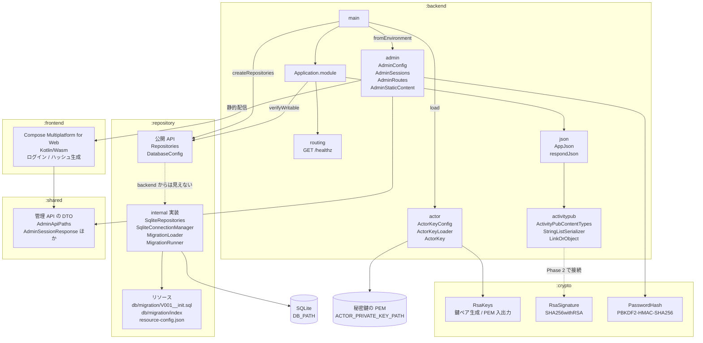
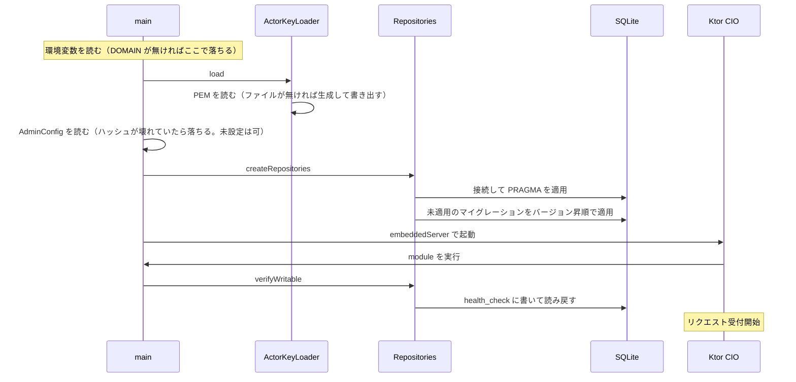

# mastodon-rss
RSS/Atom フィードを ActivityPub アクターとして配信し、Mastodon からフォローできるようにする自作サーバー。

開発の進め方とロードマップは [TODO.md](TODO.md) を参照。

## モジュール構成

| モジュール | 内容 |
| --- | --- |
| `:backend` | Ktor (CIO) のサーバー。GraalVM native-image でビルドする |
| `:crypto` | RSA 鍵と署名。JCA だけに依存し、Ktor も JDBC も入らない |
| `:repository` | SQLite への DB アクセス。公開するのは interface だけで、JDBC や SQL は外に出さない |
| `:shared` | `:backend` と `:frontend` で共有する管理 API の DTO。KMP (`jvm` + `wasmJs`) |
| `:frontend` | Compose Multiplatform for Web (Kotlin/Wasm) の管理画面 |



`:backend` から見えるのは `:repository` の公開 API だけ。実装は `internal` で、
sqlite-jdbc も `implementation` で入れているため、JDBC の型は `:backend` の
compile classpath にも現れない。

`:crypto` は `:backend` がアクターの鍵を読むために使っている。HTTP Signatures の
署名と検証で使うのは Phase 2 から。別モジュールに切り出してあるのは、
テストを native バイナリとして実行するため。`:backend` のテストは
`ktor-server-test-host` 経由で ByteBuddy と JNA を引き込み、これらは実行時の
バイトコード書き換えに依存するので native-image では動かない。JCA の確認を
そこに同居させると確認できなくなる。

`:frontend` のビルド成果物は `:backend` の `processResources` で `resources/static/` に
取り込み、`/admin` 以下で配信している。サーバーと管理画面が 1 つのバイナリに収まるので、
配るものは変わらない。代わりに `:backend` のビルドには Kotlin/Wasm のツールチェイン
（Node.js と yarn のダウンロード）が要る。

画面を触るときは 8081 番の dev サーバーの方が速い。管理 API は dev サーバーに無いので、
`/admin/api` へのリクエストは webpack の proxy 設定で 8080 番に転送している。
オリジンが同じままになるので、セッションの Cookie もそのまま乗る。

## 起動時の流れ



DB を開けなかった場合もマイグレーションに失敗した場合も、この時点で例外になって
起動が止まる。native バイナリでは SQLite のネイティブライブラリの展開に失敗しても
起動自体は通ってしまうことがあるため、書き込みの往復まで確かめている。

鍵は DB より先に読む。鍵を用意できないならサーバーを立てても意味が無いので、
先に落とすため。`DOMAIN` が無い場合も同じ理由でそれより前に落ちる。

ログは slf4j-simple で標準エラーに出る。SLF4J の実装を入れていないと Ktor 自身の
ログも含めて何も出ないため、実装を 1 つだけ入れている。logback にしないのは、
設定ファイルの読み込みに native-image 側の追加対応が要るため。

## 環境変数

| 変数 | 既定値 | 内容 |
| --- | --- | --- |
| `HOST` | `0.0.0.0` | バインドするアドレス |
| `PORT` | `8080` | 待ち受けポート |
| `DB_PATH` | `./data/mastodon-rss.db` | SQLite の DB ファイル。親ディレクトリは起動時に作られる |
| `DOMAIN` | **必須** | 外部に公開するドメイン。WebFinger の `acct:` とアクターの `id` に使う |
| `ACTOR_USERNAME` | `admin` | アクターのユーザー名。`acct:<name>@<DOMAIN>` と `/users/<name>` に入る |
| `ACTOR_PRIVATE_KEY_PATH` | `./data/actor-private-key.pem` | アクターの秘密鍵 (PEM)。無ければ起動時に生成して書き出す |
| `ACTOR_PRIVATE_KEY_PEM` | なし | 秘密鍵の PEM を直接渡す場合に使う。`ACTOR_PRIVATE_KEY_PATH` とは併用できない |
| `ADMIN_PASSWORD_HASH` | なし | 管理画面のログインパスワードのハッシュ。未設定でも起動でき、その場合はログインできない |
| `ADMIN_SESSION_TTL_MINUTES` | `720` | ログイン状態を保つ長さ（分） |
| `ADMIN_COOKIE_SECURE` | `true` | セッション Cookie に `Secure` を付けるか。http で試すときだけ `false` にする |

`DOMAIN` は `https://` などの scheme と末尾の `/` を書いても落として扱う。
未設定だと起動しない。既定値を用意して起動できてしまうと `localhost` のような
ドメインが焼き込まれたアクター ID を配ることになり、Mastodon はリモートアクターを
永続キャッシュするので、一度取得されると相手側からは直せないため。

`ACTOR_USERNAME` に使えるのは英数字と `_` `.` `-` で、先頭と末尾は英数字か `_`。
URL のパスと `acct:` の両方に入るので、区切り文字が混ざると別のものを指してしまう。
ドメインと同じく、変えると相手からは別人のアカウントに見える。

## エンドポイント

| パス | 内容 |
| --- | --- |
| `GET /healthz` | 生存確認。`{"status":"ok"}` |
| `GET /.well-known/webfinger?resource=acct:<name>@<domain>` | アカウント発見の 1 ホップ目 (RFC 7033) |
| `GET /users/{name}` | Actor JSON。プロフィールと公開鍵 |
| `GET /admin/...` | 管理画面。`:frontend` のビルド成果物を配信する |
| `GET /admin/api/session` | ログイン状態と、ログインが設定されているか |
| `POST /admin/api/login` | ログイン。成功するとセッションの Cookie を返す |
| `POST /admin/api/logout` | ログアウト |
| `POST /admin/api/password-hash` | パスワードハッシュの生成 |

`/admin` 以下は運用者だけが使う。ActivityPub のエンドポイントと違って外に開ける
必要が無いので、リバースプロキシで塞げるようパスをまとめてある。

`{name}` として応答するのは `ACTOR_USERNAME`（既定 `admin`）と、`test-` で始まる
任意の名前の 2 通り。後者は動作確認用で、下の「動作確認用のアカウント」を参照。

Mastodon は `@admin@example.com` の検索でまず WebFinger を引き、`links` の
`rel: "self"` から Actor の URL を得て、そこを取得してプロフィールカードを作る。

`Content-Type` は `application/json` ではなく WebFinger が `application/jrd+json`、
Actor が `application/activity+json`（`Accept` に `application/ld+json` が来たらそちら）。
ここを間違えるとアクターとして認識されず、検索しても何も出ない。

```sh
curl "http://localhost:8080/.well-known/webfinger?resource=acct:admin@example.com"
curl -H 'Accept: application/activity+json' http://localhost:8080/users/admin
```

外から見えるようにするには HTTPS が要る。開発中は Cloudflare Tunnel や ngrok で
`DOMAIN` に指定したホスト名に向ける。

## 動作確認用のアカウント

`test-` で始まる名前は、設定に関係なくすべてアクターとして応答する。
`@test-1@example.com` でも `@test-20260808@example.com` でも引ける。

```sh
curl "http://localhost:8080/.well-known/webfinger?resource=acct:test-1@example.com"
curl -H 'Accept: application/activity+json' http://localhost:8080/users/test-1
```

Mastodon はリモートアクターを永続キャッシュするので、内容や鍵を間違えたまま
一度取得されると相手側からは直せない。`admin` で試して失敗すると `admin` が
使えなくなるため、検証はこちらを使い、名前を変えながらやり直す。

- 中身は固定アクターと同じで、鍵も共有する。使い捨てのたびに鍵を作る意味が無いため
- `summary` が「動作確認用のアカウント」になるので、Mastodon 側の表示でも見分けられる
- 接頭辞は小文字ちょうど。`Test-1` は 404 になる（受けると `test-1` と別のアクターが生えるため）
- Phase 6 でアクターを DB から作れるようになったら消す

## アクターの鍵

Mastodon はアクターの公開鍵を持っておき、こちらから送る署名をそれで検証する。
鍵が入れ替わると検証が通らなくなり、Mastodon 側はアクターをキャッシュするので
気付いてから直しても戻りが遅い。つまり鍵は消さずに持ち続ける必要がある。

保存するのは秘密鍵だけで、公開鍵は起動のたびに秘密鍵から導く。2 つ持って
片方だけ差し替わる事故を避けるため。形式は PKCS#8 の `BEGIN PRIVATE KEY`。

読み込み元は 2 つあり、同時には指定できない。取り違えたまま起動しないよう、
両方が設定されていると起動時に落とす。

| 指定 | 動き |
| --- | --- |
| `ACTOR_PRIVATE_KEY_PATH`（既定） | ファイルがあれば読む。無ければ生成して書き出す（所有者のみ読み書き可） |
| `ACTOR_PRIVATE_KEY_PEM` | PEM をそのまま使う。ファイルには書き出さない |

どちらから読んだかは起動ログに出る。生成した場合だけ警告になるので、
運用中に出ていたら以前の鍵を失っていることになる。

docker compose ではボリュームの中（`/data/actor-private-key.pem`）に置いている。
コンテナを作り直しても同じ鍵のままだが、ボリュームごと消すとアクターは別人になる。

## 管理画面

`/admin` が管理画面。Compose Multiplatform for Web (Kotlin/Wasm) で書いたものを
`:backend` が静的配信しているので、別のプロセスを立てる必要は無い。

ログインのパスワードは `ADMIN_PASSWORD_HASH` に入れる。入れるのはパスワードそのもの
ではなくハッシュで、その作り方が画面の中にある。

### 最初の 1 回

1. `ADMIN_PASSWORD_HASH` を設定せずに起動する。この状態では誰もログインできない
2. `http://localhost:8080/admin/password-hash` を開き、パスワードを入れて生成する
3. 出てきた `ADMIN_PASSWORD_HASH=...` の 1 行を環境変数（docker compose なら `.env`）に入れる
4. 起動し直すと `/admin` からログインできる

```sh
DOMAIN=example.com ADMIN_COOKIE_SECURE=false ./gradlew :backend:run
```

http で試すときは `ADMIN_COOKIE_SECURE=false` にする。既定では Cookie に `Secure` が
付き、ブラウザが保存しないのでログインしたそばから切れる。

ハッシュ生成の口が誰にでも開いているのは `ADMIN_PASSWORD_HASH` が未設定のときだけ。
設定するとログインした人しか使えなくなる。未設定のうちに開いていても、返るのは
送ったパスワードのハッシュだけで、サーバーの状態は何も変わらない。それでも
設定前のサーバーは誰でも触れる状態なので、外に出すのは設定を済ませてからにする。

パスワードを忘れた場合は `ADMIN_PASSWORD_HASH` を外して起動し直すと、
最初の 1 回と同じ手順でやり直せる。

### 仕組み

| 項目 | 中身 |
| --- | --- |
| ハッシュ | PBKDF2-HMAC-SHA256、210,000 回、salt 16 バイト |
| 保存形式 | `pbkdf2-sha256:<反復回数>:<salt>:<ハッシュ>`。salt とハッシュは URL-safe Base64 |
| セッション | サーバーのメモリ上のトークン。Cookie は `HttpOnly` / `SameSite=Strict` |

ハッシュを 1 行に畳んでいるのは、環境変数を 1 つ増やすだけで済ませるため。salt と
反復回数を別の変数に分けると、片方だけ入れ替わって検証が通らなくなる。

区切りが `:` なのは、この種のハッシュでよくある `$` 区切り（PHC 形式）を `.env` に
貼ると docker compose が変数展開しようとして壊れるため。Base64 も URL-safe にして
あるので、クォートもエスケープも要らずにそのまま貼れる。

セッションはメモリだけに持つので、再起動するとログアウトになる。署名鍵をどこに
置くかという問題を増やしたくないため。使うのは運用者一人なので実害が無い。

bcrypt や Argon2 ではなく PBKDF2 なのは、JCA にあって依存を足さずに済むから。
native-image に持ち込む依存は少ないほど安全で、`:crypto` の他の処理と同じく
`nativeTest` で native バイナリ上でも動くことを確かめている。

## 必要なもの

- JDK 25
- native-image をビルドする場合は GraalVM 25

Gradle は wrapper が入っているので個別のインストールは不要。

## ビルド

### 全体

```sh
./gradlew build
```

### backend

```sh
# ビルドとテスト
./gradlew :backend:build

# テストのみ
./gradlew :backend:test

# repository のビルドとテスト
./gradlew :repository:build

# JVM で起動する（http://localhost:8080）
# DOMAIN は必須。手元で試すだけなら適当な値でよいが、
# Mastodon から実際に引かせるときは公開しているホスト名にすること
DOMAIN=example.com ./gradlew :backend:run
```

### crypto

```sh
# ビルドとテスト
./gradlew :crypto:build

# テストを native バイナリにして実行する（GraalVM 25 が必要）
./gradlew :crypto:nativeTest
```

`nativeTest` は JCA（RSA 鍵生成・SHA256withRSA 署名）が native-image 上で動くことを
確かめるために入れている。この種の問題は JVM のテストでは分からず、native バイナリを
動かして初めて出るため、テストごと native にして CI で継続的に見る。

### backend の native-image

GraalVM 25 が必要。

```sh
# ネイティブバイナリを生成する
./gradlew :backend:nativeCompile

# 生成されたバイナリを起動する
DOMAIN=example.com ./backend/build/native/nativeCompile/mastodon-rss
```

### frontend

```sh
# 開発サーバーを起動する（http://localhost:8081、ホットリロードあり）
./gradlew :frontend:wasmJsBrowserDevelopmentRun

# 配布物を生成する
./gradlew :frontend:wasmJsBrowserDistribution
```

配布物は `frontend/build/dist/wasmJs/productionExecutable/` に出力される。
`:backend` はこれを `resources/static/` に取り込むので、`./gradlew :backend:build` からも
このタスクが走る。

初回ビルドでは Kotlin/Wasm のツールチェイン（Node.js、yarn、webpack など）が
ダウンロードされるため時間がかかる。

開発サーバー (8081) から管理 API を叩くと 8080 に転送される。画面を触るときは
backend も起動しておくこと。

```sh
# 別の端末で backend を起動しておく
DOMAIN=example.com ADMIN_COOKIE_SECURE=false ./gradlew :backend:run
```

## コード整形

ktlint を全モジュールに入れている。スタイルは `ktlint_official`、設定は
`.editorconfig` にある。

```sh
# 違反を確認する
./gradlew ktlintCheck

# 自動修正できるものを直す
./gradlew ktlintFormat
```

CI では `ktlintCheck` が通らないとビルドが落ちる。

## JSON の返し方

Ktor の `ContentNegotiation` は入れていない。`call.respond(value)` は値の型から
serializer をリフレクションで引くため、native-image では解決できず実行時に 500 になる。
JVM のテストは通るので native バイナリを起動するまで気付けない、という形の不具合になる。

代わりに serializer を明示する。

```kotlin
call.respondJson(HealthResponse.serializer(), HealthResponse(status = "ok"))
```

ActivityPub のエンドポイントでは Content-Type も明示する。`Accept` に応じて
`application/activity+json` と `application/ld+json` を選ぶのは
`ActivityPubContentTypes.negotiate()`。

受信も同様に `call.receive<T>()` を使わず、`receiveText()` してから
`AppJson.decodeFromString(Foo.serializer(), body)` で読む。inbox は HTTP Signature の
Digest 検証に生のボディが必要なので、どのみち自動デコードには乗せられない。

## Docker で動かす

```sh
cp .env.example .env
# .env の DOMAIN を書き換えてから
docker compose up -d
```

`DOMAIN` は必須で、未設定だと compose が起動前に失敗する。

イメージは multi-stage build で、GraalVM のステージで native バイナリを作り、
実行用のステージには JDK を持ち込まない。初回は Gradle の依存取得と native-image の
ビルドが走るため時間がかかる。

DB は `data` という名前付きボリュームに置く。コンテナを作り直してもフォロワーは残る。

`HEALTHCHECK` で `/healthz` を叩いている。起動時にマイグレーションと書き込み確認が
走るので、healthy になった時点で DB まで通っている。

### GitHub Packages のイメージを使う

`main` にマージすると ghcr.io にイメージが publish される。タグは `latest` と commit SHA。

```sh
docker pull ghcr.io/matsudamper/mastodon-rss:latest
```

自分でビルドせずこれを使う場合は `docker-compose.yml` の `build:` を消す。

なお 8080 を直接インターネットに晒さないこと。ActivityPub は HTTPS 前提なので、
前段にリバースプロキシを置く。

## マイグレーション

スキーマ変更は `repository/src/main/resources/db/migration/` に
`V002__説明.sql` のような連番のファイルを足す。起動時に未適用のものが
バージョン昇順で適用され、適用済みのバージョンは `schema_version` テーブルに記録される。

ファイル名の一覧 (`db/migration/index`) は Gradle が生成するので、手で書く必要はない。
これは jar 内のディレクトリ走査が native-image で動かないことがあるため。

適用済みのファイルは書き換えないこと。チェックサムを記録しているので、
変更すると次の起動時にエラーになる。修正は新しい連番のファイルで行う。

現在のテーブル:

| テーブル | 内容 |
| --- | --- |
| `schema_version` | 適用済みマイグレーションの記録。バージョン・名前・チェックサム・適用日時 |
| `health_check` | 起動時の書き込み確認用。行は常に 1 件 |
