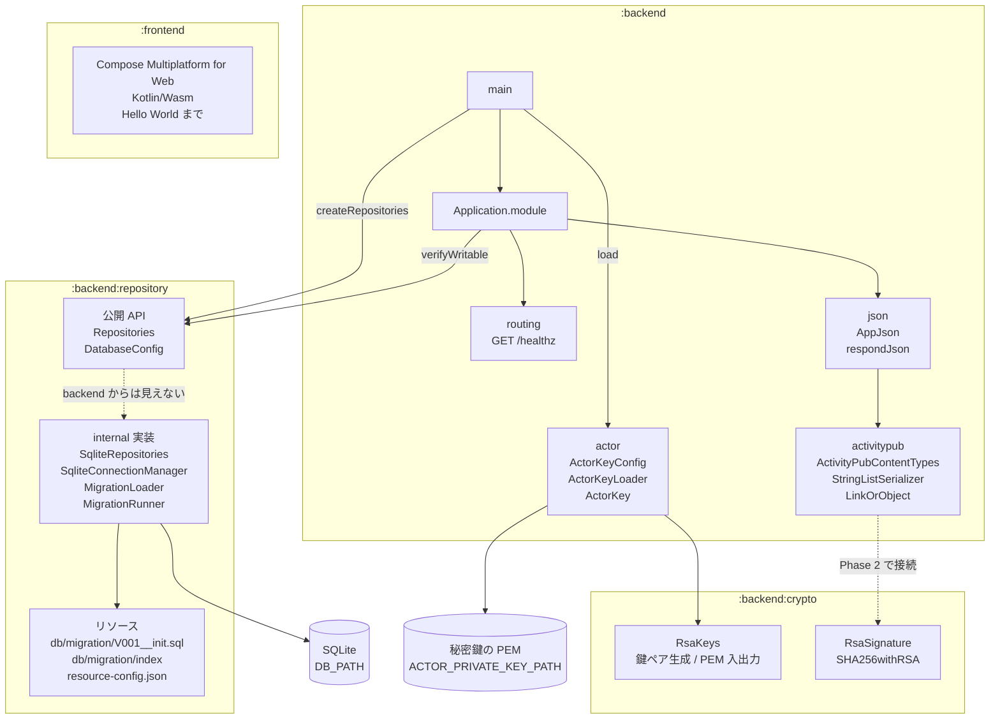

# mastodon-rss
RSS/Atom フィードを ActivityPub アクターとして配信し、Mastodon からフォローできるようにする自作サーバー。

開発の進め方とロードマップは [TODO.md](TODO.md)、実装の詳細と決めた理由は
[AGENTS.md](AGENTS.md) を参照。

## モジュール構成

| モジュール | ディレクトリ | 内容 |
| --- | --- | --- |
| `:backend` | `backend/` | Ktor (CIO) のサーバー。GraalVM native-image でビルドする |
| `:backend:crypto` | `backend/crypto/` | RSA 鍵と署名。JCA だけに依存し、Ktor も JDBC も入らない |
| `:backend:repository` | `backend/repository/` | SQLite への DB アクセス。公開するのは interface だけで、JDBC や SQL は外に出さない |
| `:frontend` | `frontend/` | Compose Multiplatform for Web (Kotlin/Wasm) の管理画面 |

`crypto` と `repository` はサーバー専用のモジュールなので `backend/` の下に置いている。
どちらも JVM のライブラリ（JCA・JDBC）に依存していて、Kotlin/Wasm でビルドする
`:frontend` からは参照できない。置き場所を見れば使う側が分かる状態にしておく。



`:frontend` と `:backend` は別々にビルドする。互いに依存させない。
`:frontend` の成果物は配信するファイルを置くディレクトリに配置し、`:backend` が
その場所を環境変数で受け取って配信する（Phase 8 で作る）。
分けた理由は [AGENTS.md](AGENTS.md) の「モジュールの分け方」を参照。

## 必要なもの

- JDK 25
- native-image をビルドする場合は GraalVM 25

Gradle は wrapper が入っているので個別のインストールは不要。

## ビルド

### 全体

```sh
./gradlew build
```

### backend

```sh
# ビルドとテスト
./gradlew :backend:build

# テストのみ
./gradlew :backend:test

# repository のビルドとテスト
./gradlew :backend:repository:build

# JVM で起動する（http://localhost:8080）
# DOMAIN は必須。手元で試すだけなら適当な値でよいが、
# Mastodon から実際に引かせるときは公開しているホスト名にすること
DOMAIN=example.com ./gradlew :backend:run
```

### crypto

```sh
# ビルドとテスト
./gradlew :backend:crypto:build

# テストを native バイナリにして実行する（GraalVM 25 が必要）
./gradlew :backend:crypto:nativeTest
```

`nativeTest` は JCA（RSA 鍵生成・SHA256withRSA 署名）が native-image 上で動くことを
確かめるために入れている。この種の問題は JVM のテストでは分からず、native バイナリを
動かして初めて出るため、テストごと native にして CI で継続的に見る。

### backend の native-image

GraalVM 25 が必要。

```sh
# ネイティブバイナリを生成する
./gradlew :backend:nativeCompile

# 生成されたバイナリを起動する
DOMAIN=example.com ./backend/build/native/nativeCompile/mastodon-rss
```

### frontend

```sh
# 開発サーバーを起動する（http://localhost:8081、ホットリロードあり）
./gradlew :frontend:wasmJsBrowserDevelopmentRun

# 配布物を生成する
./gradlew :frontend:wasmJsBrowserDistribution
```

配布物は `frontend/build/dist/wasmJs/productionExecutable/` に出力される。

初回ビルドでは Kotlin/Wasm のツールチェイン（Node.js、yarn、webpack など）が
ダウンロードされるため時間がかかる。

## 環境変数

| 変数 | 既定値 | 内容 |
| --- | --- | --- |
| `HOST` | `0.0.0.0` | バインドするアドレス |
| `PORT` | `8080` | 待ち受けポート |
| `DB_PATH` | `./data/mastodon-rss.db` | SQLite の DB ファイル。親ディレクトリは起動時に作られる |
| `DOMAIN` | **必須** | 外部に公開するドメイン。WebFinger の `acct:` とアクターの `id` に使う |
| `ACTOR_USERNAME` | `admin` | アクターのユーザー名。`acct:<name>@<DOMAIN>` と `/users/<name>` に入る |
| `ACTOR_PRIVATE_KEY_PATH` | `./data/actor-private-key.pem` | アクターの秘密鍵 (PEM)。無ければ起動時に生成して書き出す |
| `ACTOR_PRIVATE_KEY_PEM` | なし | 秘密鍵の PEM を直接渡す場合に使う。`ACTOR_PRIVATE_KEY_PATH` とは併用できない |

`DOMAIN` と `ACTOR_USERNAME` は書式と、変えたときに何が起きるかに制約がある。
[AGENTS.md](AGENTS.md) の「ドメインとユーザー名」を参照。

## エンドポイント

| パス | 内容 |
| --- | --- |
| `GET /healthz` | 生存確認。`{"status":"ok"}` |
| `GET /.well-known/webfinger?resource=acct:<name>@<domain>` | アカウント発見の 1 ホップ目 (RFC 7033) |
| `GET /users/{name}` | Actor JSON。プロフィールと公開鍵 |

`{name}` として応答するのは `ACTOR_USERNAME`（既定 `admin`）と、`test-` で始まる
任意の名前の 2 通り。後者は動作確認用で、[AGENTS.md](AGENTS.md) の
「動作確認用のアカウント」を参照。

```sh
curl "http://localhost:8080/.well-known/webfinger?resource=acct:admin@example.com"
curl -H 'Accept: application/activity+json' http://localhost:8080/users/admin
```

外から見えるようにするには HTTPS が要る。開発中は Cloudflare Tunnel や ngrok で
`DOMAIN` に指定したホスト名に向ける。

## Docker で動かす

```sh
cp .env.example .env
# .env の DOMAIN を書き換えてから
docker compose up -d
```

`DOMAIN` は必須で、未設定だと compose が起動前に失敗する。

イメージは multi-stage build で、GraalVM のステージで native バイナリを作り、
実行用のステージには JDK を持ち込まない。初回は Gradle の依存取得と native-image の
ビルドが走るため時間がかかる。

DB は `data` という名前付きボリュームに置く。コンテナを作り直してもフォロワーは残る。

`HEALTHCHECK` で `/healthz` を叩いている。起動時にマイグレーションと書き込み確認が
走るので、healthy になった時点で DB まで通っている。

### GitHub Packages のイメージを使う

`main` にマージすると ghcr.io にイメージが publish される。タグは `latest` と commit SHA。

```sh
docker pull ghcr.io/matsudamper/mastodon-rss:latest
```

自分でビルドせずこれを使う場合は `docker-compose.yml` の `build:` を消す。

なお 8080 を直接インターネットに晒さないこと。ActivityPub は HTTPS 前提なので、
前段にリバースプロキシを置く。

## コード整形

ktlint を全モジュールに入れている。スタイルは `ktlint_official`、設定は
`.editorconfig` にある。

```sh
# 違反を確認する
./gradlew ktlintCheck

# 自動修正できるものを直す
./gradlew ktlintFormat
```

CI では `ktlintCheck` が通らないとビルドが落ちる。
