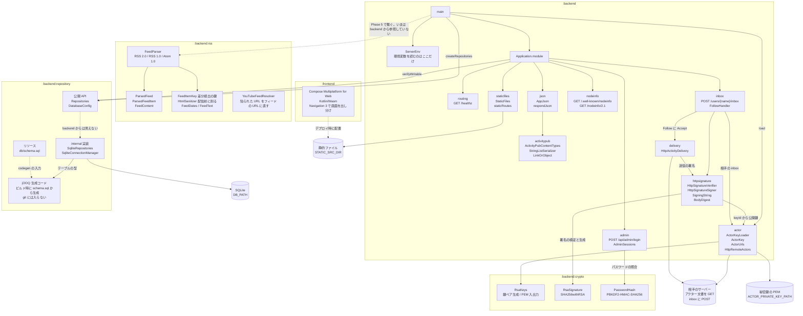

# mastodon-rss
RSS/Atom フィードを ActivityPub アクターとして配信し、Mastodon からフォローできるようにする自作サーバー。

開発の進め方とロードマップは [TODO.md](TODO.md)、横断的な設計は
[docs/architecture.md](docs/architecture.md)、Mastodon から見える仕様
（エンドポイント・鍵の扱いなど）は [docs/mastodon-spec.md](docs/mastodon-spec.md) を参照。

## モジュール構成

| モジュール | ディレクトリ | 内容 |
| --- | --- | --- |
| `:backend` | `backend/` | Ktor (CIO) のサーバー。GraalVM native-image でビルドする |
| `:frontend` | `frontend/` | Compose Multiplatform for Web (Kotlin/Wasm) の画面。管理画面とアカウント画面 |



`:frontend` と `:backend` は別々にビルドする。互いに依存させない。
`:frontend` の成果物は配信するファイルを置くディレクトリに配置し、`:backend` が
その場所を `STATIC_SRC_DIR` で受け取って root から配信する。
分けた理由は [docs/architecture.md](docs/architecture.md) を参照。

## 必要なもの

- JDK 25
- native-image をビルドする場合は GraalVM 25

Gradle は wrapper が入っているので個別のインストールは不要。

## ビルド

### 全体

```sh
# ビルドとテスト
./gradlew build

# テストのみ
./gradlew test
```

### backend

```sh
# JVM で起動する（http://localhost:8080）
# DOMAIN は必須。手元で試すだけなら適当な値でよいが、
# Mastodon から実際に引かせるときは公開しているホスト名にすること
DOMAIN=example.com ./gradlew :backend:run
```

起動できたかは `GET /healthz` で見る。`{"status":"ok"}` が返れば動いている。

### backend の native-image

GraalVM 25 が必要。

```sh
# ネイティブバイナリを生成する
./gradlew :backend:nativeCompile

# 生成されたバイナリを起動する
DOMAIN=example.com ./backend/build/native/nativeCompile/mastodon-rss
```

### frontend

```sh
# 開発サーバーを起動する（http://localhost:8081、ホットリロードあり）
./gradlew :frontend:wasmJsBrowserDevelopmentRun

# 配布物を生成する
./gradlew :frontend:wasmJsBrowserDistribution
```

配布物は `frontend/build/dist/wasmJs/productionExecutable/` に出力される。

初回ビルドでは Kotlin/Wasm のツールチェイン（Node.js、yarn、webpack など）が
ダウンロードされるため時間がかかる。

### backend から画面を出す

```sh
./gradlew :frontend:wasmJsBrowserDistribution

# DOMAIN は画面の配信には関係しないが、必須なので入れる
DOMAIN=example.com \
STATIC_SRC_DIR=frontend/build/dist/wasmJs/productionExecutable \
  ./gradlew :backend:run
```

配信の挙動は
[StaticFiles.kt](backend/src/main/kotlin/net/matsudamper/mastodon/rss/staticfiles/StaticFiles.kt)、
環境変数は [ServerEnv.kt](backend/src/main/kotlin/net/matsudamper/mastodon/rss/ServerEnv.kt) を参照。

### 画面のパス

サーバーが持つパス以外は静的ファイルの配信に落ちる。ファイルがあればそれを返し、
無ければ `index.html` を返して画面側に解釈させる。どの画面を出すかはブラウザ側の判断になる。

| パス | 画面 |
| --- | --- |
| `/` | トップ |
| `/@{name}` | アカウント画面。フィードの取得状況と配信した記事 |
| `/admin` | 管理画面。ログインが要る。中身はログインまでで、その先は Phase 8 |
| それ以外 | 見つからない（HTTP は 200 のまま） |

### 管理画面のログイン

`/admin` にはログインが要る。パスワード 1 つで、ユーザー名は無い。

パスワードそのものはサーバーに置かず、ハッシュを `ADMIN_PASSWORD_HASH` に入れる。
ハッシュは標準入力にパスワードを渡して作る。引数にするとシェルの履歴と `ps` に平文で残る。

```sh
# 表示された 1 行がそのまま ADMIN_PASSWORD_HASH の値
./gradlew --quiet :backend:crypto:passwordHash
```

手元で試すときは `ADMIN_COOKIE_SECURE=false` を付ける。既定ではセッション Cookie に
`Secure` が付き、`http://localhost:8080` ではブラウザが Cookie を保存しないので、
ログインしてもログインしていない状態のままになる。

```sh
DOMAIN=example.com \
STATIC_SRC_DIR=frontend/build/dist/wasmJs/productionExecutable \
ADMIN_PASSWORD_HASH='pbkdf2-sha256:...' \
ADMIN_COOKIE_SECURE=false \
  ./gradlew :backend:run
```

`ADMIN_PASSWORD_HASH` が未設定でも起動する。最初のハッシュを作る前に起動できないと
先に進めないため。この場合はログインできず、画面と起動ログにその旨が出る。

ログイン後に出るのは「ログイン済み」だけ。フィードの登録や配信状況は、管理 API（GraphQL）を
作ってから繋ぐ。セッションの持ち方と Cookie の扱いは
[docs/architecture.md](docs/architecture.md) を参照。

画面は canvas に描いているので、ブラウザの持っているフォントは使われない。日本語を出すために
Noto Sans JP を `/fonts/*.ttf` として一緒に配信し、起動後に読み込んで当てている。
実体は `frontend/src/wasmJsMain/resources/fonts/`（SIL Open Font License 1.1。同じ場所に
`OFL.txt` を置いてある）で、読み込みは `:frontend` の `ui/Font.kt`。

表示している数値と記事はまだ仮の値で、画面の上にその旨を出している。

## 環境変数

| 変数 | 既定値 | 内容 |
| --- | --- | --- |
| `HOST` | `0.0.0.0` | バインドするアドレス |
| `PORT` | `8080` | 待ち受けポート |
| `DB_PATH` | `./data/mastodon-rss.db` | SQLite の DB ファイル。親ディレクトリは起動時に作られる |
| `DOMAIN` | **必須** | 外部に公開するドメイン。WebFinger の `acct:` とアクターの `id` に使う |
| `ACTOR_USERNAME` | `admin` | アクターのユーザー名。`acct:<name>@<DOMAIN>` と `/users/<name>` に入る |
| `ACTOR_PRIVATE_KEY_PATH` | `./data/actor-private-key.pem` | アクターの秘密鍵 (PEM)。無ければ起動時に生成して書き出す |
| `ACTOR_PRIVATE_KEY_PEM` | なし | 秘密鍵の PEM を直接渡す場合に使う。`ACTOR_PRIVATE_KEY_PATH` とは併用できない |
| `STATIC_SRC_DIR` | なし | 配信する静的ファイルのディレクトリ。未設定なら何も配信しない |
| `ADMIN_PASSWORD_HASH` | なし | 管理画面のパスワードハッシュ。未設定でも起動するが、その間はログインできない |
| `ADMIN_COOKIE_SECURE` | `true` | セッション Cookie に `Secure` を付けるか。手元で http で試すときだけ `false` にする |

`DOMAIN` は scheme と末尾の `/` を書いても落として扱う。未設定だと起動しない。
`ACTOR_USERNAME` に使えるのは英数字と `_` `.` `-` で、先頭と末尾は英数字か `_`。

どちらもアクターの ID に焼き込まれ、変えると相手からは別人のアカウントに見える。
理由は `ServerEnv.kt` と `ActorUsername.kt` の KDoc にある。

エンドポイント、動作確認用のアカウント、アクターの鍵の扱いなど、
ビルド以外の仕様は [docs/mastodon-spec.md](docs/mastodon-spec.md) にまとめてある。

## スキーマを変えるとき

`schema.sql` と同じ場所に置いた
[backend/repository/src/main/resources/db/README.md](backend/repository/src/main/resources/db/README.md)
を参照。開発用 DB から `dumpSchema` で書き出して commit し、実 DB へは sqlite3def で
手適用する。そこから jOOQ の型が作られるまでも書いてある。
