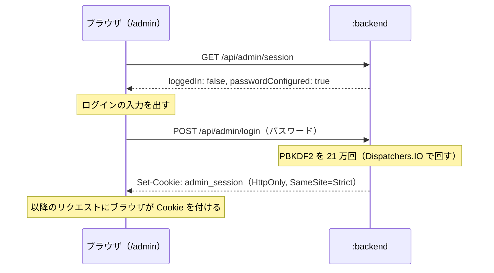
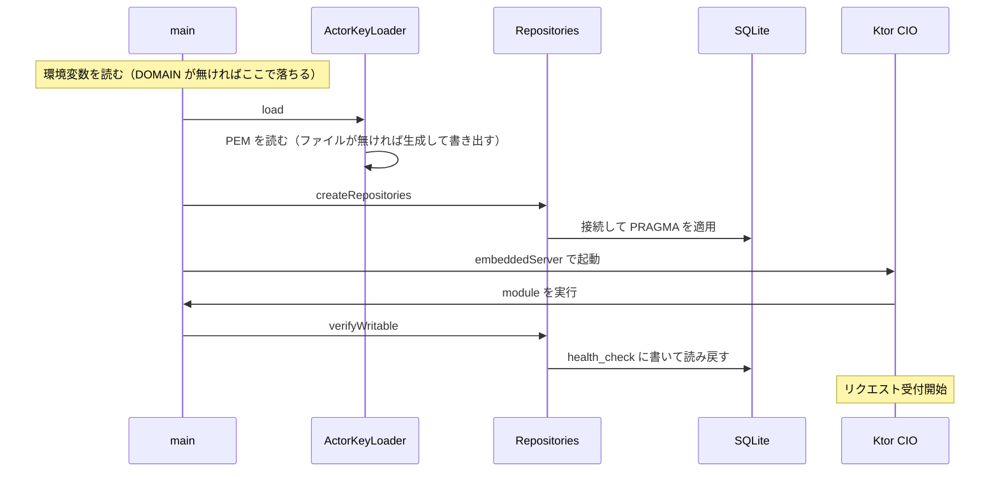

# 設計

コードの 1 か所に紐付かない、横断的な決めごとを置く。個別の判断はコードの KDoc と
ビルドスクリプトのコメントに書いてあるので、こちらには重複させない。

使い方は [README.md](../README.md)、外に対して何をどう応答するかは
[mastodon-spec.md](mastodon-spec.md)、これからやることは [TODO.md](../TODO.md) を参照。

## モジュールの分け方

`:backend` から見えるのは `:backend:repository` の公開 API だけ。実装は `internal` で、
sqlite-jdbc と jOOQ も `implementation` で入れているため、JDBC と jOOQ の型は
`:backend` の compile classpath にも現れない。jOOQ の生成コードも
`:backend:repository` の中で閉じていて、外には出さない。

`:backend:repository` の責務は DB 専用ではない。どこからデータを読むかを
呼び出し側から隠す境界で、DB はその実装のひとつでしかない。実際 `ExpiringCache` は
プロセスのメモリ上に持つだけの取得口としてここに置いてある。DB の口だけを束ねているのは
`Repositories` で、モジュールそのものと同じ広さではない。

`:backend:crypto` は `:backend` がアクターの鍵を読むために使っている。HTTP Signatures の
署名と検証で使うのは Phase 2 から。別モジュールに切り出してあるのは、
テストを native バイナリとして実行するため。`:backend` のテストは
`ktor-server-test-host` 経由で ByteBuddy と JNA を引き込み、これらは実行時の
バイトコード書き換えに依存するので native-image では動かない。JCA の確認を
そこに同居させると確認できなくなる。

`:backend:rss` は RSS/Atom の XML を読んで値を取り出すだけのモジュール。
HTTP も DB も知らず、入力はバイト列で出力は `ParsedFeed`。分けた理由は 2 つある。

1 つは `:backend:crypto` と同じで、テストを native バイナリとして実行するため。
StAX (`javax.xml`) はパーサの実装を実行時に探すので、native-image で解決に失敗すると
JVM のテストが全部通ったまま実バイナリだけが落ちる。

もう 1 つは、取得と保存を混ぜないため。フィードの取得（HTTP）と保存（DB）を
同じモジュールに入れると、解析のテストにサーバーと DB が要るようになる。
解析は入力と出力が決まっていて、実物のフィードの崩れ方を固定していく場所なので、
テストが軽いことに意味がある。

保存する形の型（`FeedRepository` / `FeedItemRepository` とその周りのデータクラス）は
`:backend:repository` に置いていて、`ParsedFeed` とは別物にしてある。同じ型を
使い回すと、DB のスキーマを変えるたびにパーサを触ることになるため。詰め替えは
両方を知っている取り込み処理（Phase 5 で `:backend` に置く）の仕事にする。

環境変数を読むのは `:backend` の入口（`ServerEnv`）だけにする。`:backend:repository` の
ような下位のモジュールは、値を引数で受け取る。

## ビルドスクリプトに手続きを書かない

タスクの定義は `build-logic`（複合ビルドとして取り込むプラグイン）に置く。
`build.gradle.kts` に残すのは、プラグインの適用と、依存とパッケージ名のような
そのモジュール固有の値だけにする。

`doLast` に処理を直接書くと、入力と出力の宣言が曖昧なままでも動いてしまう。
プラグイン側で型のあるタスクにすれば、何が入力で何が出力かを書かないと
コンパイルが通らない。up-to-date 判定とビルドキャッシュはその宣言に乗るので、
宣言が正しいことがそのまま再ビルドの正しさになる。

バージョンはプラグインに持たせない。`build-logic` からも同じ
`gradle/libs.versions.toml` を読む。プラグイン側に書くと version catalog の
外にバージョンが散り、Renovate の追従から外れる。

`build-logic` は別のビルドなので、root の `ktlintCheck` からは辿られない。
CI が叩くのは root の `ktlintCheck` だけなので、root の build.gradle.kts で
繋いである。

`:frontend` と `:backend` のビルドを繋がないのは、繋ぐとサーバーのテストが
Kotlin/Wasm のツールチェイン（Node.js と yarn）に引きずられるため。wasm 側が
壊れているとサーバーのテストも回せなくなる。配信は実行時のディレクトリを読む形にして、
ビルドの依存を作らない。詳細は [TODO.md](TODO.md) の「ビルドと配布の分け方」を参照。

## 画面のパス

サーバーが持つパス以外は静的配信に落ち、ファイルが無ければ `index.html` が返る。
どの画面を出すかを決めるのはブラウザ側（`:frontend` の `navigation/Screen.kt`）で、
サーバーは画面のパスを 1 つも知らない。

| パス | 画面 |
| --- | --- |
| `/` | トップ |
| `/@{name}` | アカウント画面 |
| `/admin` 以下 | 管理画面。ログインが要る |
| それ以外 | 見つからない |

アカウント画面を `/@{name}` にして ActivityPub の `/users/{name}` と分けているのは、
1 つのパスで `Accept` を見て HTML と JSON を出し分けると、相手側の `Accept` の綴りの
揺れでアカウントごと見つからなくなるため。Mastodon 自身も 2 つに分けている。

サーバー側で 1 箇所だけこの決まりを知っているのが `StaticFiles`。拡張子のあるパスは
`index.html` に落とさない規則の例外として、`@` で始まるセグメントを画面のパスとして扱う。
ユーザー名には `.` が使えるので、`/@name.example` を拡張子付きと見なすと開けなくなる。

管理画面は `/admin` の下にだけ出す。以前はパスに関係なく管理画面が出ていて、
アカウント画面のつもりで開いても管理画面が表示されていた。

画面は canvas に描くので、ブラウザが持っているフォントも `@font-face` も効かない。
日本語のフォントは静的ファイルと一緒に `/fonts/` で配信し、起動後に取ってきて
`FontFamily` を組み立てる（`:frontend` の `ui/Font.kt`）。配信するファイルの置き場を
管理画面専用にせず `STATIC_SRC_DIR` にまとめてあるのは、こういうものが入るため。

## 管理画面のログイン

パスワード 1 つとセッションで見る。ユーザー名は無い。管理画面を開くのは運用者だけで、
名前を足しても覚えるものが増えるだけになる。

パスワードそのものは持たず、`ADMIN_PASSWORD_HASH` にハッシュ（PBKDF2-HMAC-SHA256、
`:backend:crypto` の `PasswordHash`）を入れる。ハッシュは
`./gradlew --quiet :backend:crypto:passwordHash` で作る。

未設定でも起動する。最初のハッシュを作る前に起動できないと先に進めないため。
この場合はログインできず、画面には設定方法が出る。起動ログにも警告を出す。

セッションはメモリ上のトークン（`AdminSessions`）で、期限は 12 時間。署名付き Cookie に
して状態を持たない形も選べるが、署名鍵をどこから渡すかという設定が増えるうえ、鍵を固定すると
ログアウトさせる手段が無くなる（発行済みの Cookie が期限まで有効なまま残る）。サーバーは 1 台で
再起動も稀なので、再起動でログインし直しになる代わりに設定が増えない方を選んでいる。

ログインの口は GraphQL（Phase 8）には入れない。認証が無いと叩けない口の中に認証そのものを
置くと、未ログインでも通す例外をスキーマ側に作ることになる。フィードの CRUD などの管理 API は
`/graphql` に寄せ、そちらの認可は `AdminSessions` で見る。

Cookie の `Secure` は既定で付ける。本番はリバースプロキシで HTTPS を終端する前提だが、
プロキシの後ろではリクエストの scheme が http に見えるのでサーバーからは判定できない。
手元で `localhost:8080` を平文で開いて試すときだけ `ADMIN_COOKIE_SECURE=false` にする。
付けたまま http で開くと、ブラウザが Cookie を保存せず、ログインしてもログインしていない
状態のままになる。

総当たり対策（試行回数の制限）はまだ無い。Phase 7 で入れる。

## 起動時の流れ

スキーマの適用は起動時にはやらない。実 DB へは sqlite3def で手適用する運用で、
適用していない DB（空の DB を含む）で起動すると `verifyWritable` が
`no such table` で落ちる。適用のしかたは `db/schema.sql` と同じ場所の README を参照。

DB を開けなかった場合もスキーマが無い場合も、この時点で例外になって
起動が止まる。native バイナリでは SQLite のネイティブライブラリの展開に失敗しても
起動自体は通ってしまうことがあるため、書き込みの往復まで確かめている。

鍵は DB より先に読む。鍵を用意できないならサーバーを立てても意味が無いので、
先に落とすため。`DOMAIN` が無い場合も同じ理由でそれより前に落ちる。

ログは slf4j-simple で標準エラーに出る。SLF4J の実装を入れていないと Ktor 自身の
ログも含めて何も出ないため、実装を 1 つだけ入れている。logback にしないのは、
設定ファイルの読み込みに native-image 側の追加対応が要るため。
