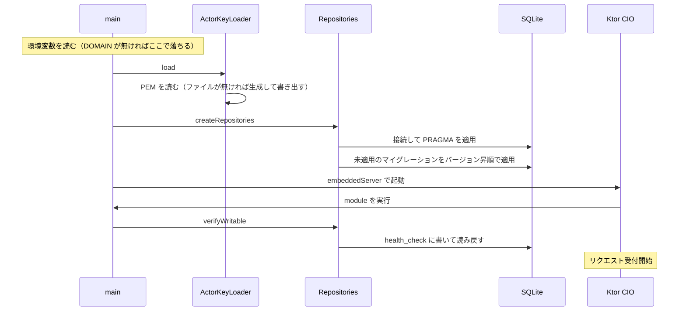

# 設計

コードの 1 か所に紐付かない、横断的な決めごとを置く。個別の判断はコードの KDoc と
ビルドスクリプトのコメントに書いてあるので、こちらには重複させない。

使い方は [README.md](../README.md)、これからやることは [TODO.md](../TODO.md) を参照。

## モジュールの分け方

`:backend` から見えるのは `:backend:repository` の公開 API だけ。実装は `internal` で、
sqlite-jdbc も `implementation` で入れているため、JDBC の型は `:backend` の
compile classpath にも現れない。

`:backend:crypto` は `:backend` がアクターの鍵を読むために使っている。HTTP Signatures の
署名と検証で使うのは Phase 2 から。別モジュールに切り出してあるのは、
テストを native バイナリとして実行するため。`:backend` のテストは
`ktor-server-test-host` 経由で ByteBuddy と JNA を引き込み、これらは実行時の
バイトコード書き換えに依存するので native-image では動かない。JCA の確認を
そこに同居させると確認できなくなる。

環境変数を読むのは `:backend` の入口（`ServerEnv`）だけにする。`:backend:repository` の
ような下位のモジュールは、値を引数で受け取る。

`:frontend` と `:backend` のビルドを繋がないのは、繋ぐとサーバーのテストが
Kotlin/Wasm のツールチェイン（Node.js と yarn）に引きずられるため。wasm 側が
壊れているとサーバーのテストも回せなくなる。配信は実行時のディレクトリを読む形にして、
ビルドの依存を作らない。詳細は [TODO.md](TODO.md) の「ビルドと配布の分け方」を参照。

## 画面のパス

サーバーが持つパス以外は静的配信に落ち、ファイルが無ければ `index.html` が返る。
どの画面を出すかを決めるのはブラウザ側（`:frontend` の `navigation/Screen.kt`）で、
サーバーは画面のパスを 1 つも知らない。

| パス | 画面 |
| --- | --- |
| `/` | トップ |
| `/@{name}` | アカウント画面 |
| `/admin` 以下 | 管理画面。認証を掛ける対象（Phase 8） |
| それ以外 | 見つからない |

アカウント画面を `/@{name}` にして ActivityPub の `/users/{name}` と分けているのは、
1 つのパスで `Accept` を見て HTML と JSON を出し分けると、相手側の `Accept` の綴りの
揺れでアカウントごと見つからなくなるため。Mastodon 自身も 2 つに分けている。

サーバー側で 1 箇所だけこの決まりを知っているのが `StaticFiles`。拡張子のあるパスは
`index.html` に落とさない規則の例外として、`@` で始まるセグメントを画面のパスとして扱う。
ユーザー名には `.` が使えるので、`/@name.example` を拡張子付きと見なすと開けなくなる。

管理画面は `/admin` の下にだけ出す。以前はパスに関係なく管理画面が出ていて、
アカウント画面のつもりで開いても管理画面が表示されていた。

画面は canvas に描くので、ブラウザが持っているフォントも `@font-face` も効かない。
日本語のフォントは静的ファイルと一緒に `/fonts/` で配信し、起動後に取ってきて
`FontFamily` を組み立てる（`:frontend` の `ui/Font.kt`）。配信するファイルの置き場を
管理画面専用にせず `STATIC_SRC_DIR` にまとめてあるのは、こういうものが入るため。

## 起動時の流れ

DB を開けなかった場合もマイグレーションに失敗した場合も、この時点で例外になって
起動が止まる。native バイナリでは SQLite のネイティブライブラリの展開に失敗しても
起動自体は通ってしまうことがあるため、書き込みの往復まで確かめている。

鍵は DB より先に読む。鍵を用意できないならサーバーを立てても意味が無いので、
先に落とすため。`DOMAIN` が無い場合も同じ理由でそれより前に落ちる。

ログは slf4j-simple で標準エラーに出る。SLF4J の実装を入れていないと Ktor 自身の
ログも含めて何も出ないため、実装を 1 つだけ入れている。logback にしないのは、
設定ファイルの読み込みに native-image 側の追加対応が要るため。
